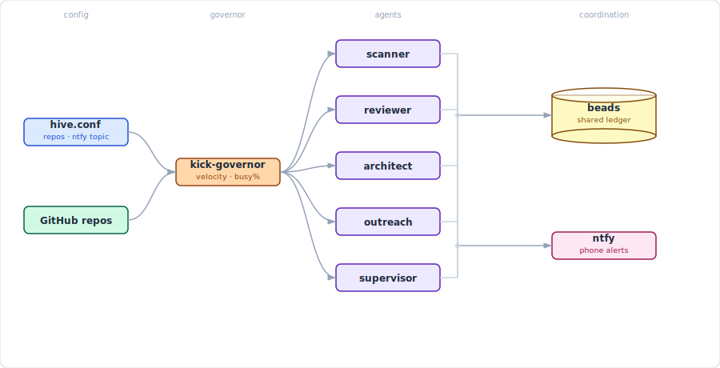

# hive

**One command starts everything. Your phone, Slack, or Discord buzzes if anything needs you.**


---



---

## Setup

```bash
# 1. install tmux
sudo apt install tmux

# 2. install hive
curl -fsSL https://raw.githubusercontent.com/kubestellar/hive/main/install.sh | sudo bash

# 3. configure
sudo nano /etc/hive/hive.conf

# 4. start
hive supervisor
```

That's it. `hive supervisor` installs missing tools, starts all agents, sets the kick cadence, and launches the supervisor. No tmux knowledge needed.

---

## Commands

```bash
hive supervisor             # start everything
hive status                 # live terminal dashboard (cached repo data)
hive status --repos         # refresh repo issue/PR counts from GitHub API
hive status --json          # machine-readable JSON output
hive status --json --repos  # JSON with fresh repo data (used by dashboard slow path)
hive status --watch 5       # auto-refresh every 5 seconds (in-place overwrite)
hive dashboard              # launch web dashboard (port 3001)
hive attach supervisor      # watch the supervisor  (Ctrl+B D to leave)
hive attach scanner         # watch any agent

hive kick all               # immediate kick to all agents
hive kick scanner           # kick one agent

hive switch scanner claude  # switch CLI backend (pins it)
hive switch reviewer copilot
hive unpin scanner          # let governor manage CLI again

hive logs governor          # tail governor decisions
hive logs scanner           # tail any agent's service log

hive stop all               # stop everything
```

---

## Web Dashboard

`hive dashboard` launches a real-time web dashboard on port 3001.

- **Live updates** via SSE — agent states, governor mode, repo counts, and beads refresh every 5 seconds
- **Sparkline history** — per-agent busy time and restart count sparklines with rolling history
- **Restart tracking** — 24-hour restart count per agent with color-coded thresholds (yellow >0, red >5)
- **Kick buttons** — one-click kick for any agent
- **Switch dropdown** — switch agent CLI backend from the UI (auto-pins to prevent governor override)
- **CLI pinning** — `hive switch` pins the backend so the governor won't override it; `hive unpin` releases it
- **Intensity gauge** — half-circle speedometer comparing recent vs trailing token rates (cooling → steady → surging)
- **Coverage tracking** — shows test coverage progress toward the configured target
- **Übersicht widget** — download a macOS desktop widget from the button in the header
- **Fast/slow refresh** — agent status refreshes every 5s; GitHub repo data refreshes every 60s to avoid API rate limits

The dashboard runs as a systemd service (`hive-dashboard.service`) and auto-restarts on failure.

```bash
# Manual access
open http://192.168.4.56:3001    # from LAN
open http://localhost:3001       # from hive itself

# Install Übersicht widget (macOS)
curl -sf http://192.168.4.56:3001/api/widget | tar xzf - -C "$HOME/Library/Application Support/Übersicht/widgets/"
```

---

## How it works

The **kick-governor** measures issue and PR backlog across your repos every 5 minutes and picks a mode:

| Mode | Trigger | Scanner | Reviewer | Architect | Outreach | Supervisor |
|------|---------|---------|----------|-----------|----------|-----------|
| SURGE | queue > 20 | 10 min | 10 min | **paused** | **paused** | 5 min |
| BUSY  | queue > 10 | 15 min | 15 min | **paused** | **paused** | 5 min |
| QUIET | queue > 2  | 15 min | 30 min | 1 h        | 2 h        | 5 min |
| IDLE  | queue ≤ 2  | 30 min | 1 h    | 30 min     | 30 min     | 5 min |

Architect and outreach are **opportunistic** — they fill idle cycles and pause entirely under load. Supervisor runs every 5 min regardless of mode.

Cadences are tunable in `/etc/hive/governor.env` — no restart needed.

### Restart tracking

Each supervisor process tracks agent restarts in `/var/run/kick-governor/restarts_<session>`. The count is a rolling 24-hour window — old timestamps are pruned automatically. The dashboard and `hive status --json` both expose the `restarts` field per agent.

---

## Deterministic Pipeline

Hive separates work into two layers:

- **Deterministic layer** (shell scripts + JSON + config) — handles every decision where a human would give the same answer every time. Runs before agents wake up.
- **Non-deterministic layer** (LLM agents) — receives pre-computed data and focuses on judgment calls: reading code, reasoning about fixes, writing PRs.

The rule: **if a human would give the same answer every time, it belongs in infrastructure, not in a prompt.**

LLMs treat "NEVER" rules as suggestions. No amount of prompt engineering reliably prevents an agent from closing a hold-labeled issue or merging an untested PR. The deterministic pipeline removes those decisions from the agent entirely.

### Pipeline stages

Each stage runs as a shell script, declared in `hive-project.yaml`, with explicit dependencies:

| Category | What it does | Example |
|----------|-------------|---------|
| **Enumerator** | Fetches and filters the canonical work list | `enumerate-actionable.sh` — queries GitHub, excludes hold/exempt labels, filters by author |
| **Classifier** | Enriches items with deterministic metadata | `issue-classifier.sh` — complexity, model tier, lane assignment based on label/title patterns |
| **Gate** | Pre-checks eligibility before action | `merge-gate.sh` — CI green? Author authorized? Required reviews in? |
| **Monitor** | Detects state in external systems | `ga4-anomaly-detector.sh` — production error spikes; `copilot-comment-checker.sh` — unaddressed review comments |
| **Enforcer** | Blocks agents from forbidden operations | `gh` wrapper — prevents merging to main, closing hold issues, pushing to protected branches |

Stages declare their consumers and dependencies. The pipeline runner resolves the DAG and executes in parallel where possible.

### Adding a pipeline stage

1. Add an entry to `pipeline.stages[]` in `hive-project.yaml`
2. Write the script in `bin/`
3. Declare `output`, `consumers`, `phase`, and `depends`
4. The pipeline runner picks it up on the next kick cycle

### Config-driven rules

Classification patterns, clustering signals, severity keywords, and exempt labels all live in `hive-project.yaml`. Scripts read rules from config — they don't contain project-specific logic. Change the config, change the behavior.

---

## Adapting for Your Project

Hive is designed to be forked and configured, not hardcoded. All project-specific values live in `hive-project.yaml`.

### Step by step

1. **Copy the example config:**
   ```bash
   sudo cp examples/kubestellar/hive-project.yaml /etc/hive/hive-project.yaml
   ```

2. **Edit the `project` section** — your org, repos, AI author account:
   ```yaml
   project:
     name: "My Project"
     org: "my-org"
     primary_repo: "my-org/my-repo"
     repos:
       - my-org/my-repo
       - my-org/my-docs
     ai_author: "my-bot-account"
   ```

3. **Edit `agents.enabled`** — pick which agents you need:
   ```yaml
   agents:
     enabled:
       - supervisor
       - scanner
       - reviewer
       # - architect    # optional
       # - outreach     # optional
       # - docs-agent   # add your own
   ```

4. **Edit `classification`** — your labels, lane patterns, complexity rules:
   ```yaml
   classification:
     complexity:
       simple:
         labels: ["typo", "docs"]
         model: "haiku"
       complex:
         labels: ["architecture", "epic"]
         model: "opus"
       default_model: "sonnet"
   ```

5. **Copy and edit agent CLAUDE.md files** from `examples/kubestellar/agents/`. Template variables like `${PROJECT_ORG}`, `${PROJECT_PRIMARY_REPO}`, and `${PROJECT_AI_AUTHOR}` are substituted automatically at kick time — you don't need to hardcode your project values.

6. **Set agent `.env` files** with your workdir and model preferences.

7. **Start:**
   ```bash
   hive supervisor
   ```

### Template variables

Agent policy files (CLAUDE.md) support these template variables, substituted by `kick-agents.sh` at kick time:

| Variable | Source in config | Example value |
|----------|-----------------|---------------|
| `${PROJECT_ORG}` | `project.org` | `kubestellar` |
| `${PROJECT_PRIMARY_REPO}` | `project.primary_repo` | `kubestellar/console` |
| `${PROJECT_AI_AUTHOR}` | `project.ai_author` | `clubanderson` |
| `${PROJECT_REPOS_LIST}` | `project.repos` | `kubestellar/console kubestellar/docs ...` |
| `${HIVE_REPO}` | `project.hive_repo` | `kubestellar/hive` |
| `${GA4_PROPERTY_ID}` | `outreach.ga4.property_id` | `525401563` |
| `${AGENTS_WORKDIR}` | `agents.workdir` | `/home/dev/my-project` |
| `${BEADS_BASE}` | `agents.beads_base` | `/home/dev` |

---

## Backends

Set `HIVE_BACKENDS` in `hive.conf`. `HIVE_AUTO_INSTALL=true` installs missing backends on startup.

| Backend | Type | Description |
|---------|------|-------------|
| `claude` | CLI | Anthropic's CLI — runs Claude models directly |
| `gemini` | CLI | Google's CLI — runs Gemini models directly |
| `copilot` | Aggregate | GitHub Copilot — routes to Claude, GPT, Gemini, and other vendor models |
| `goose` | Aggregate | Block's Goose — routes to any model via config: qwen, deepseek, llama, and more (cloud or local) |

**Native backends** (`claude`, `gemini`) are single-vendor tools that run their own models directly. **Aggregate backends** (`copilot`, `goose`) are multi-vendor routers — they can call models from different providers through a single interface.

### Local models (optional)

Set `HIVE_MODEL_SERVICES="ollama litellm"` to run models on-device with no API costs.

```
ollama        → runs local models (llama3, codestral, qwen2.5-coder, ...)
    └── litellm proxy :4000  ← unified OpenAI-compatible endpoint
            └── goose        ← points here when AGENT_BACKEND=goose
```

Ollama and litellm start as background services before any agent session launches.

---

## Notifications

hive sends alerts to any combination of ntfy, Slack, and Discord. Set whichever you use in `hive.conf` — all three fire simultaneously if configured.

| Channel | Config key | How to get it |
|---------|-----------|---------------|
| ntfy (phone push) | `NTFY_TOPIC` | Free at [ntfy.sh](https://ntfy.sh) — pick any topic string |
| Slack | `SLACK_WEBHOOK` | api.slack.com/apps → Incoming Webhooks |
| Discord | `DISCORD_WEBHOOK` | Channel Settings → Integrations → Webhooks |

---

## Config

`/etc/hive/hive.conf` — the only file you need to edit:

```bash
# Repos to watch (space-separated)
HIVE_REPOS="owner/repo1 owner/repo2"

# Agent CLI backends to use (space-separated)
HIVE_BACKENDS="copilot"          # copilot claude gemini goose

# Local model services (optional — needs GPU or fast CPU)
# HIVE_MODEL_SERVICES="ollama litellm"

# Auto-install missing backends on hive supervisor start
HIVE_AUTO_INSTALL=true

# Notifications — set any combination
NTFY_TOPIC=your-secret-topic     # free at ntfy.sh
# SLACK_WEBHOOK=https://hooks.slack.com/services/...
# DISCORD_WEBHOOK=https://discord.com/api/webhooks/...
```

---

## Troubleshooting

```bash
hive status                  # check what's running
hive logs governor           # why did it kick / not kick?
hive logs scanner            # what is scanner doing?
hive attach supervisor       # watch supervisor live
journalctl -u claude-scanner # raw service log
```

### Common issues

| Symptom | Cause | Fix |
|---------|-------|-----|
| All agents idle, no ntfy | Governor crashing (check `hive logs governor`) | See below |
| Governor: `Permission denied` on `/var/run/kick-governor/` | Root-owned files from `sudo` operations | `sudo chown -R dev:dev /var/run/kick-governor/` |
| Governor: `Slack: command not found` | Broken comments in `notify.sh` | Reinstall: `sudo cp bin/notify.sh /usr/local/bin/notify.sh` |
| Governor: `$2: unbound variable` | `set -u` + missing arg defaults | Use `${N:-}` syntax in all function params |
| Dashboard: agents show `stopped` / CLI `?` | Service running as root (can't see dev's tmux) | Add `User=dev` to `hive-dashboard.service` |
| Dashboard: widget download 404 | Stale node process on port 3001 | `ss -tlnp \| grep 3001` → `kill <PID>` → restart service |
| `bd dolt push` fails | Root-owned `.beads/` files | `sudo chown -R dev:dev ~/.beads/ /home/dev/scanner-beads/.beads/` |
| Beads: `?` in status | `bd list` blocked by stale lock | `sudo killall -9 bd && rm -f /home/dev/scanner-beads/.beads/embeddeddolt/.lock` |

---

Apache 2.0  ·  [Architecture](docs/architecture.md)  ·  [KubeStellar example](examples/kubestellar/)
