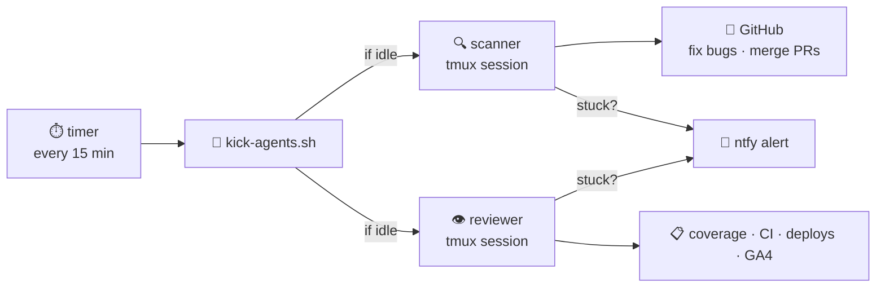

# supervised-agent

**Give an AI a job. It runs 24/7. Your phone buzzes if it gets stuck.**

---



---

## Setup (5 min)

```bash
# 1. clone
git clone https://github.com/kubestellar/supervised-agent.git
cd supervised-agent && sudo ./install.sh

# 2. start your agent in tmux
tmux new-session -s issue-scanner -d
tmux send-keys -t issue-scanner "cd /your/project && claude" Enter

# 3. enable the timer
sudo systemctl enable --now kick-scanner.timer kick-reviewer.timer
```

That's it. The timer kicks your agents every 15 min. If they're busy, it skips.

---

## Phone alerts

```bash
# get a free topic at ntfy.sh, subscribe in the ntfy app, then:
NTFY_TOPIC=your-secret-topic   # add to your config
```

---

## Manual kick

```bash
kick-agents.sh all        # kick scanner + reviewer
kick-agents.sh scanner    # scanner only
kick-agents.sh reviewer   # reviewer only
```

---

## Key files

| File | Purpose |
|------|---------|
| `bin/kick-agents.sh` | Sends work orders to tmux sessions |
| `systemd/kick-scanner.timer` | Fires every 15 min |
| `systemd/kick-reviewer.timer` | Fires every 30 min |
| `bin/agent-supervisor.sh` | Restarts crashed sessions |
| `examples/kubestellar/` | Real 4-agent setup — read this for ideas |

---

## Troubleshooting

```bash
tmux attach -t issue-scanner          # watch it live (Ctrl+B D to leave)
systemctl list-timers kick-*          # check next fire time
journalctl -u kick-scanner -f         # see logs
kick-agents.sh scanner                # manual kick
```

---

Apache 2.0 · [Full docs](docs/architecture.md) · [Real example](examples/kubestellar/)
