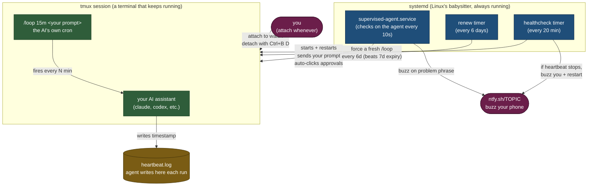
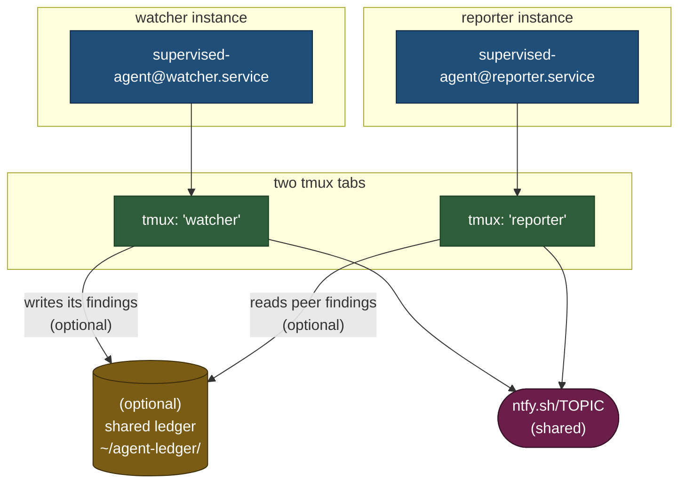

# supervised-agent

**Run an AI assistant 24/7 to do a job for you. Get a text when it needs help.**

You tell it the job. It does the job every few minutes, forever. If it crashes, it restarts itself. If it gets stuck, your phone pings. If the internet goes down, it picks up when it's back. You don't have to babysit it.

People have used this to:

- 🔍 **Watch a GitHub repo** for new bugs and fix the easy ones automatically
- 📊 **Check website traffic** every hour and write a daily report
- 🧪 **Run a test suite** on a schedule and file an issue when something breaks
- 🛎️ **Monitor a status page** and text the on-call when a service goes down
- 📝 **Draft a blog post outline** from your week's git commits, every Friday
- 🤖 **Babysit a long research task** that takes days of thinking time

If you can describe the job to an AI chatbot, you can run it here on a loop.

---

## What you need

- A computer that stays on — **Linux** (laptop, cheap cloud VM, Raspberry Pi 4) or **macOS** (Mac Mini, Mac Studio, always-on laptop)
- An AI assistant CLI that has an **interactive** mode (this repo was built with [Claude Code](https://www.anthropic.com/claude-code), but it works with anything similar — Codex CLI, local LLMs with a TUI, etc.)
- About 10 minutes

That's it. You don't need Kubernetes. You don't need Docker. On Linux you'll use systemd; on macOS you'll use launchd — both are built-in process managers that keep things running.

---

## Quickstart — 10 minutes from zero to running

### 1. Grab the code

```sh
git clone https://github.com/kubestellar/supervised-agent.git
cd supervised-agent
```

### 2. Make sure you have the basics

```sh
which tmux curl bash      # should print paths, not "not found"
which claude              # (or whatever AI CLI you're using)
```

If `tmux` or `curl` are missing: `sudo apt install tmux curl` (Ubuntu/Debian) or `sudo dnf install tmux curl` (Fedora/RHEL) or `brew install tmux curl` (macOS). If `claude` is missing, install it from [claude.ai/code](https://claude.ai/code) first and log in with `claude /login`.

> **macOS users**: the quickstart below uses Linux/systemd commands. For macOS/launchd setup, see **[docs/macos.md](docs/macos.md)** — same concepts, different process manager.

### 3. Write your config

```sh
sudo mkdir -p /etc/supervised-agent
sudo cp config/agent.env.example /etc/supervised-agent/agent.env
sudo nano /etc/supervised-agent/agent.env      # (or whatever editor you like)
```

The important lines to change:

```sh
# Which user should run the agent? Pick your regular user, NOT root.
AGENT_USER=yourname

# What folder does the agent work in?
AGENT_WORKDIR=/home/yourname/my-project

# What should the agent do? Change this to describe your job.
AGENT_LOOP_PROMPT="/loop 15m Check /home/yourname/my-project for new files I haven't looked at. Summarize them in a new file called todo.md."

# Where should the agent write its "I did a thing at HH:MM" heartbeat?
AGENT_LOG_FILE=/home/yourname/.local/state/supervised-agent/heartbeat.log
```

Everything else has reasonable defaults. Ignore it for now.

### 4. Install

```sh
sudo ./install.sh
```

Done. The agent is running and will stay running.

### 5. Watch it work

```sh
sudo -u yourname tmux attach -t supervised-agent
```

You're now looking over the AI's shoulder. It does one pass, waits 15 minutes, does another, forever. **When you're ready to leave, press `Ctrl+B` then `D` to detach.** The agent keeps running.

### To uninstall

```sh
sudo ./uninstall.sh
```

---

## Get texted when something goes wrong

Your agent is running, but what if something breaks at 3am? Set up free phone notifications via [ntfy.sh](https://ntfy.sh).

1. Install the **ntfy** app on your phone: [iOS](https://apps.apple.com/app/ntfy/id1625396347) · [Android](https://play.google.com/store/apps/details?id=io.heckel.ntfy)
2. Make up a **secret-looking** topic name (don't use common words — anyone who guesses it can see your alerts). An easy way:
   ```sh
   uuidgen      # prints something like 7f2a8e1c-6b4d-49f2-9a1b-d3f7e08b2c4a
   ```
3. In the ntfy app, tap `+` and **Subscribe** to that topic name.
4. Test it from your laptop:
   ```sh
   curl -d "hello from my laptop" ntfy.sh/7f2a8e1c-6b4d-49f2-9a1b-d3f7e08b2c4a
   ```
   Your phone should buzz within a second or two. ✅
5. Put that topic in your config:
   ```sh
   sudo nano /etc/supervised-agent/agent.env
   # Set:  NTFY_TOPIC=7f2a8e1c-6b4d-49f2-9a1b-d3f7e08b2c4a
   sudo systemctl restart supervised-agent-healthcheck.timer
   ```

Now if the agent stalls or hits a usage limit, your phone buzzes.

---

## Telling the agent what to do

### Option A — Self-scheduling (simple)

The `AGENT_LOOP_PROMPT` in your config is just plain English instructions. The agent registers its own timer and re-fires on that cadence forever.

```sh
# simplest: ask it to do one thing every N minutes
AGENT_LOOP_PROMPT="/loop 30m Summarize today's commits in /home/me/project/commits-today.md"

# point it at a longer policy file so you can edit the rules without re-installing
AGENT_LOOP_PROMPT="/loop 15m Read /home/me/my-policy.md and do what it says."
```

The second pattern scales better. If you start writing complex rules, stop stuffing them into the env var and put them in a markdown file. Your agent can re-read the file every iteration — edit the markdown, behavior updates, no restart needed.

See [`examples/scanner-policy.md`](examples/scanner-policy.md) for a full example.

### Option B — EXECUTOR MODE (operator-driven)

Instead of the agent self-scheduling, you send it work orders directly via `tmux send-keys`. The agent starts, reads its policy, then **waits at the prompt** for instructions. You decide when it fires and what it does.

```sh
# startup prompt — no /loop
AGENT_LOOP_PROMPT="You are in EXECUTOR MODE. Read my-policy.md from memory. Report current status. Then WAIT for work orders via tmux. Between orders: monitor open PRs and merge AI-authored ones when CI is green."
```

Then from any shell:

```sh
# IMPORTANT: always split text and Enter into two calls.
# tmux send-keys -l "…text… Enter" sends the word "Enter" as literal text.
tmux send-keys -t my-agent -l "Fix issue #42 and open a PR."
sleep 1
tmux send-keys -t my-agent Enter
```

**When to use EXECUTOR MODE:**
- You're running multiple agents and want a single supervisor session to prioritize across all of them
- You want to inspect the agent's output before triggering the next step
- The agent keeps re-registering its own cron despite being told not to (EXECUTOR MODE removes the cron entirely)

**Disable the renew timer** when using EXECUTOR MODE — there is no cron to renew:

```sh
sudo systemctl disable --now supervised-agent-renew@my-agent.timer
```

See [`docs/architecture.md`](docs/architecture.md) for the full EXECUTOR MODE sequence diagram and multi-agent topology.

---

## Running more than one agent at once

Once you get the hang of it, you might want two agents doing different jobs on the same machine. For example: one watches your GitHub repos and one watches your website traffic. Each gets its own config and its own "tab":

```sh
# make two configs
sudo cp config/agent.env.example /etc/supervised-agent/watcher.env
sudo cp config/agent.env.example /etc/supervised-agent/reporter.env
sudo nano /etc/supervised-agent/watcher.env     # configure it
sudo nano /etc/supervised-agent/reporter.env    # configure that one too

# install each one
sudo ./install.sh --instance watcher
sudo ./install.sh --instance reporter

# attach to whichever you want to peek at
sudo -u me tmux attach -t watcher
sudo -u me tmux attach -t reporter
```

When you want two agents to **coordinate** (one notices a problem, the other fixes it), see [`examples/reviewer-policy.md`](examples/reviewer-policy.md) for how to use a shared ledger. For tighter control over multiple agents, use **EXECUTOR MODE** — run your own supervisor session that sends targeted work orders to each agent instead of letting them self-schedule independently. See [`docs/architecture.md`](docs/architecture.md) for the full multi-agent topology.

### Hybrid pattern: scanner script + AI agent

Instead of running two full AI sessions, you can run a lightweight **bash scanner** on a timer that writes to a SQLite database, and only invoke the AI when there's actionable work. This is cheaper (no LLM usage for scanning), more resilient (scanning continues even if the AI session is down), and gives you a durable audit trail.

See [`examples/kubestellar-fixer.md`](examples/kubestellar-fixer.md) for a full case study, [`examples/worker.sh.example`](examples/worker.sh.example) for the scanner script, and [`examples/sqlite-state.md`](examples/sqlite-state.md) for the SQLite schema.

Uninstall one without touching the other: `sudo ./uninstall.sh --instance reporter`.

---

## Troubleshooting

### "It says the agent's /loop prompt never fires"

The supervisor waits for a specific text to appear in the agent's terminal before sending the prompt. For Claude Code v2.x it's `bypass permissions on`. If your agent shows something different, edit your env:

```sh
AGENT_READY_MARKER="your agent's ready text"
```

Then restart: `sudo systemctl stop supervised-agent && sudo -u me tmux kill-session -t supervised-agent && sudo systemctl start supervised-agent`

### "The agent keeps asking me to approve something"

Find the unique text of the "Yes" button and set:

```sh
AGENT_AUTO_APPROVE_PHRASE="Yes, and always allow access to"
```

The supervisor will auto-click it from now on.

### "I edited AGENT_LOOP_PROMPT but nothing changed"

`systemctl restart` alone doesn't work — the running tmux session keeps the old prompt in memory. Full reset:

```sh
sudo systemctl stop supervised-agent
sudo -u me tmux kill-session -t supervised-agent
sudo systemctl start supervised-agent
```

### "I want to see what the agent has been doing"

Three places to look:

```sh
# the agent's own heartbeat log (what it wrote each iteration)
tail -f /home/me/.local/state/supervised-agent/heartbeat.log

# the supervisor's log (crashes, restarts, prompt sends)
sudo journalctl -u supervised-agent -f

# attach and watch live
sudo -u me tmux attach -t supervised-agent
```

### "Nothing makes sense, I want to start over"

```sh
sudo ./uninstall.sh        # removes the agent
# edit /etc/supervised-agent/agent.env to fix whatever was wrong
sudo ./install.sh          # puts it back
```

Your config is never deleted by uninstall.

---

## How it actually works (for the curious)



**In plain English**:

- **tmux** is a terminal-tab that keeps running even after you log out. Think of it as a persistent "screen" the AI can type into.
- **systemd** is Linux's babysitter. It starts the supervisor at boot, restarts it if it crashes, and is the thing that never dies.
- **The supervisor** (`agent-supervisor.sh`) is a tiny bash script that checks the AI's tmux tab every 10 seconds. If the AI process died, it spawns a new one and re-sends your prompt. If the AI is showing a specific error message (like "usage limit reached"), it texts your phone.
- **The healthcheck timer** independently watches the heartbeat log. If the AI is alive but silently not doing work, the healthcheck notices and reboots it.
- **The renew timer** is a once-every-6-days safety net. Claude Code's `/loop` cron auto-expires at 7 days; by renewing at 6, we never hit the expiration cliff.

You can delete any of these scripts or units and the rest keep working — they're independent.

### Multi-instance topology (two or more agents sharing a machine)

When you run `./install.sh --instance watcher` and `./install.sh --instance reporter`, each gets its own systemd triplet and tmux session. They're totally isolated unless you deliberately wire them together via a shared coordination file (a "beads ledger" — see the examples dir).



---

## All the env vars (reference)

| Variable | Required? | Default | What it does |
|---|---|---|---|
| `AGENT_USER` | yes | — | Unix user the agent runs as (NOT `root`) |
| `AGENT_WORKDIR` | yes | — | Folder the agent works in |
| `AGENT_LAUNCH_CMD` | yes | — | Command that starts the AI assistant |
| `AGENT_LOOP_PROMPT` | yes | — | The instructions you send to the AI after it starts |
| `AGENT_LOG_FILE` | yes | — | Where the agent writes a timestamp each iteration |
| `AGENT_SESSION_NAME` | no | `supervised-agent` | Name of the tmux tab |
| `AGENT_READY_MARKER` | no | `bypass permissions on` | Text that means "AI is ready for input" |
| `AGENT_READY_TIMEOUT_SEC` | no | `45` | Seconds to wait for that text before retrying |
| `AGENT_POLL_SEC` | no | `10` | How often the supervisor checks in |
| `AGENT_AUTO_APPROVE_PHRASE` | no | `Yes, and always allow access to` | Auto-click this button if it appears |
| `AGENT_AUTO_DISMISS_PHRASES` | no | (blank) | Auto-Escape these prompts if they appear |
| `AGENT_NOTIFY_ON_PHRASE_REGEX` | no | (blank) | Text ping (doesn't auto-act) |
| `AGENT_NOTIFY_ON_PHRASE_TITLE` / `_BODY` | no | (defaults) | Customize the text ping |
| `AGENT_STALE_MAX_SEC` | no | `1800` | If no heartbeat for this long, reboot the agent |
| `AGENT_MAX_RESPAWNS` | no | `3` | Give up auto-restarting after this many tries |
| `NTFY_TOPIC` | no | (blank = disabled) | ntfy topic for phone pings |

---

## Safety notes (read before you break something)

- **Don't run this as root.** Make a regular user if you don't have one and set `AGENT_USER=` to it.
- **Don't put passwords or API keys in `agent.env`.** That file is just for config. Put secrets in your AI assistant's own credential store. (Claude Code keeps its OAuth token in `~/.claude/.credentials.json`. Don't hand-edit that file either.)
- **Your ntfy topic is the only "password" on your phone pings.** Make it unguessable. Use `uuidgen`.
- **If you give the AI access to things like `git push`, `rm`, or your cloud account, it can do real damage.** Pick prompts that are narrowly scoped. "Fix bugs and open PRs" is a big ask — maybe start with "summarize and draft, don't push."
- **This runtime doesn't know if your AI is making good choices.** The healthcheck only knows "the agent wrote a heartbeat file." If your AI is busily writing heartbeats and secretly destroying files, the supervisor is happy. Read your agent's output sometimes.

---

## Contributing / license

Apache 2.0 — see [LICENSE](LICENSE). PRs welcome, especially:

- Recipes for specific agents (Codex CLI, local LLMs, etc.)
- Additional `AGENT_*` hooks for new kinds of prompts you want auto-handled
- Packaging (Homebrew, Nix, Debian `.deb`, Docker image) for easier install
- macOS/launchd improvements (see [docs/macos.md](docs/macos.md))
- Case studies of real deployments (see [examples/kubestellar-fixer.md](examples/kubestellar-fixer.md) for the format)

See [OWNERS](OWNERS) for maintainers.
